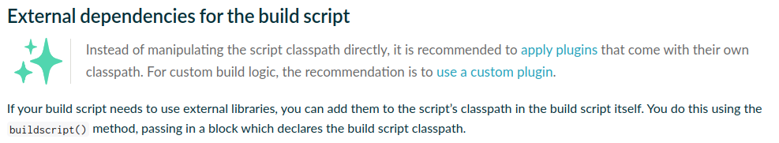

# Gradle Custom Plugins

## Tasks

### From build.gradle.kts

```shell
/gradlew -q hello
```

```shell
/gradlew -q greeting
```

### From buildSrc
```shell
/gradlew -q greeting-from-buildsrc
```

### From standalone project/module
```kotlin
dependencies {
    classpath(files("standalone-task/build/libs/standalone-task-1.0.0-SNAPSHOT.jar"))
}
```

```shell
/gradlew -q greeting-from-standalone-task
```



## Plugins
### Incremental Tasks using files

- Setup Tasks
- Extention

```shell
./gradle -q fileAnalizerTask
```

### Options

```shell
./gradle -q fileAnalizerTask --skip
```